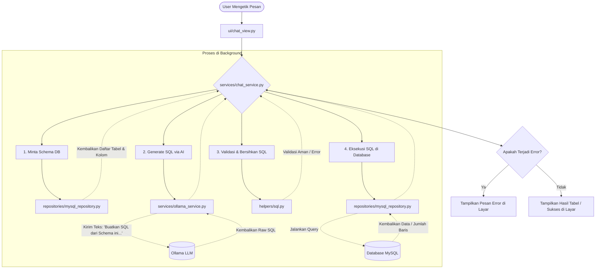

# NL2SQL 🤖🧠
NL2SQL adalah singkatan dari Natural Language to Structured Query Language. Sederhananya, ini adalah teknologi yang memungkinkan komputer untuk mengubah bahasa manusia sehari-hari (seperti Bahasa Indonesia atau Inggris) menjadi kode perintah database (SQL) secara otomatis.

Teknologi ini bertujuan untuk menjembatani celah antara pengguna awam yang tidak paham pemrograman dengan data kompleks yang tersimpan di dalam database.

## Rumusan Masalah NL2SQL ⚠️

Masalah dalam NL2SQL umumnya terbagi menjadi tiga kategori besar:

A. Ambiguitas Bahasa Manusia (Linguistic Ambiguity)
   Bahasa manusia sering kali tidak spesifik.
   
   Masalah: Pengguna mungkin bertanya, "Siapa pelanggan terbaik kita?". Kata "terbaik" bisa berarti pelanggan dengan transaksi terbanyak, total belanjaan tertinggi, atau yang paling       lama berlangganan.
   
   Dampak: AI bingung menentukan kolom mana yang harus digunakan untuk pengurutan (ORDER BY).

B. Struktur Database yang Kompleks (Schema Mapping)
   Masalah : Nama kolom dalam database sering kali menggunakan singkatan teknis (misal: cust_id_fin_01) yang tidak mirip dengan bahasa manusia ("Nomor Identitas Pelanggan").

   Dampak: AI gagal memetakan kata benda dalam kalimat ke nama tabel atau kolom yang benar.

C. Join dan Logika Bertingkat (Complex Queries)
   Masalah: Pertanyaan yang membutuhkan data dari banyak tabel (Multi-join) atau filter bertingkat (Subqueries).

   Dampak: SQL yang dihasilkan sering kali salah dalam menghubungkan kunci utama (Primary Key) dan kunci asing (Foreign Key).

## Bagaimana Cara Kerja NL2SQL?
✅ Proses NL2SQL biasanya melibatkan kecerdasan buatan (AI), khususnya Natural Language Processing (NLP). Berikut adalah alur sederhananya:

✅ Input Pengguna: Anda mengetik pertanyaan seperti, "Tampilkan daftar karyawan yang memiliki gaji di atas 10 juta."

✅ Analisis AI: Sistem menganalisis struktur kalimat, mencari kata kunci (entitas), dan memetakannya ke tabel serta kolom yang ada di database.

✅ Generasi SQL: AI menyusun kode SQL yang valid berdasarkan analisis tersebut.

✨ Hasil: SELECT * FROM karyawan WHERE gaji > 10000000;

✨ Eksekusi: Kode tersebut dijalankan di database, dan hasilnya diberikan kembali kepada Anda.

## Mengapa NL2SQL Penting?
Ada beberapa alasan, mengapa NL2SQL sangat penting.

🤖 Demokratisasi Data: Orang di bagian pemasaran, HR, atau manajer tingkat atas bisa mengambil data sendiri tanpa harus menunggu bantuan dari tim IT atau data analyst.

🤖 Efisiensi Waktu: Menulis query SQL yang kompleks bisa memakan waktu. Dengan NL2SQL, prosesnya hanya butuh hitungan detik.

🤖 Mengurangi Kesalahan Manusia: Mengurangi risiko typo atau kesalahan logika saat menulis perintah manual yang panjang.

## Dasar-Dasar Database (SQL) 🗄️
Sebelum mengubah bahasa alami menjadi SQL, Anda harus sangat mahir dalam SQL itu sendiri.

- DML (Data Manipulation Language): SELECT, INSERT, UPDATE, DELETE.

- Complex Joins: Memahami INNER, LEFT, RIGHT, dan FULL JOIN.

- Aggregation & Grouping: GROUP BY, HAVING, dan fungsi jendela (window functions).

- Database Schema: Memahami relasi Primary Key dan Foreign Key serta normalisasi database.

## 💡 Studi Kasus & Contoh Implementasi

* **Kasus 1: Cek Stok Produk**
  * *Input:* "Tampilkan semua produk yang stoknya kurang dari 10 biji"
  * *Output Query:* `SELECT * FROM products WHERE stock < 10;`

* **Kasus 2: Total Belanja Pelanggan**
  * *Input:* "Berapa total uang yang dihabiskan oleh pelanggan dengan ID 12345?"
  * *Output Query:* `SELECT SUM(total_price) FROM orders WHERE customer_id = 12345;`

## Kesimpulan NL2SQL
NL2SQL adalah alat penting dalam era demokratisasi data, yang mengubah cara manusia berinteraksi dengan database dari yang dulunya harus menggunakan kode kaku, sekarang cukup dengan mengobrol santai.

## 🧑‍💻 Qwen 2.5
Qwen 2.5 adalah seri model kecerdasan buatan (Artificial Intelligence / AI) berbasis bahasa besar (Large Language Model / LLM) yang dikembangkan oleh Alibaba Cloud.

Model ini dirancang sebagai pesaing tangguh bagi model AI global lainnya seperti Llama 3 dari Meta maupun model berbayar seperti GPT-4. Qwen 2.5 dilatih menggunakan data skala raksasa hingga 18 triliun token, membuatnya memiliki basis pengetahuan (common sense) dan logika penalaran yang sangat mendalam.

## Peran Utama Qwen 2.5 dalam Chatbot Perbelanjaan
#### - Rekomendasi Produk yang Personalisasi:
Bukan sekadar mencarikan barang berdasarkan kata kunci, Qwen 2.5 bisa memahami kebutuhan kontekstual pelanggan.

Contoh: Jika pelanggan mengetik *"Saya butuh baju untuk acara outdoor minggu depan, tapi kulit saya sensitif kalau kena panas,"* chatbot dapat merekomendasikan pakaian berbahan katun atau linen yang longgar, lengkap dengan alasan pemilihannya.

#### - Memahami Bahasa Kasual dan Multibahasa:
Pelanggan sering menggunakan bahasa gaul, singkatan, atau mencampur bahasa (anak Jaksel). Qwen 2.5 yang memiliki pemahaman bahasa (NLP) sangat kuat dapat menangkap maksud pembeli dengan akurat, termasuk dalam Bahasa Indonesia sehari-hari atau daerah.

#### - Perbandingan Produk yang Cerdas:
Chatbot bisa membantu pembeli yang kebingungan memilih antara dua atau tiga produk. Chatbot akan membuatkan tabel perbandingan kelebihan dan kekurangan masing-masing produk secara instan berdasarkan ulasan pengguna dan spesifikasi barang.

#### - Penanganan Komplain dan Retur secara Empatis:
Jika pelanggan marah karena barang rusak atau salah kirim, Qwen 2.5 dapat merespons dengan gaya bahasa yang sopan, menenangkan, dan langsung memberikan prosedur retur sesuai kebijakan toko tanpa membuat pelanggan frustrasi.

## Kesimpulan Qwen 2.5
Menggunakan Qwen 2.5 (terutama ukuran 7B atau 14B yang efisien namun cerdas) untuk chatbot perbelanjaan akan meningkatkan kenyamanan konsumen (customer experience) dan membantu menaikkan angka penjualan karena proses tanya-jawab hingga checkout terasa seperti mengobrol dengan pelayan toko asli.

## API Yang Digunakan Adalah OLLAMA
Ollama bertindak sebagai jembatan yang menjalankan model bahasa besar (Large Language Model seperti Qwen 2.5, Llama 3, atau Gemma 2) di infrastruktur Anda sendiri, dan menyediakan API untuk dihubungkan ke aplikasi chatbot toko. 

## 🛠️ Apa Yang Dilakukan Oleh OLLAMA?

### Dengan menggunakan API, Kita bisa membuat program yang secara otomatis melakukan hal-hal berikut:

- Generate Response: Mengirim perintah teks dan mendapatkan jawaban.

- Streaming: Mendapatkan jawaban kata demi kata secara real-time (seperti ChatGPT).

- Chat: Mengelola percakapan yang memiliki riwayat (memory).

- Model Management: Meminta sistem untuk mengunduh (pull), menghapus, atau menyalin model AI tertentu melalui kode.

- Embeddings: Mengubah teks menjadi angka (vektor) untuk kebutuhan pencarian data tingkat lanjut (RAG).

## Bagaimana Cara Kerja API Ollama dalam Ekosistem Belanja ❔❔
### Dalam praktiknya, API Ollama tidak bekerja sendirian, melainkan diintegrasikan dengan database toko melalui sistem backend Anda:

- Input Pembeli: Pelanggan mengetik: *"Saya cari sepatu lari warna biru ukuran 42."*

- Backend & Retrieval (RAG): Backend Anda mendeteksi bahwa ini adalah pencarian produk. Sistem akan mengambil data stok sepatu olahraga biru ukuran 42 dari database e-commerce.

- Mengirim ke API Ollama: Backend mengirimkan data stok tersebut bersama pertanyaan pembeli ke API Ollama lewat perintah instruksi (system prompt).

- Respons AI: Model di dalam Ollama menyusun jawaban dengan bahasa yang ramah, persuasif, dan alami, lalu mengirimkannya kembali ke ruang obrolan pembeli.

### Logic Flowchart (Alur Kerja Program)

Berikut adalah diagram alur (Flowchart) yang menjelaskan urutan kerja saat pengguna melakukan Chat (bertanya ke database):

